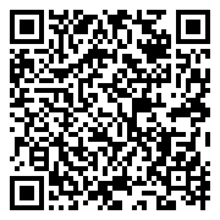

# OrtakÇizim

**Çocuklar için yerel ağda canlı ortak çizim tahtası.**
İki veya daha fazla telefon aynı Wi-Fi’da olduğunda, biri ekranda çizdiğinde diğerleri anında görür. Hesap yok, internet yok, sunucu yok.

> iOS & Android · Flutter · AES-256-GCM · UDP broadcast
> **Güncel sürüm: [v0.3.1](https://github.com/jumabayev/OrtakCizim/releases/tag/v0.3.1)**

## Android APK indirme

<table>
  <tr>
    <td align="center" width="220">
      <a href="https://github.com/jumabayev/OrtakCizim/releases/download/v0.3.1/ortakcizim-v0.3.1.apk">
        
      </a>
      <br>
      <sub>Telefonun kamerasıyla okut</sub>
    </td>
    <td>
      <p><b>📥 Doğrudan indirme:</b></p>
      <p><a href="https://github.com/jumabayev/OrtakCizim/releases/download/v0.3.1/ortakcizim-v0.3.1.apk">ortakcizim-v0.3.1.apk</a> (~46 MB)</p>
      <p><b>🗂 Tüm sürümler:</b></p>
      <p><a href="https://github.com/jumabayev/OrtakCizim/releases">github.com/jumabayev/OrtakCizim/releases</a></p>
      <ol>
        <li>APK'yı indir</li>
        <li>Telefonda <i>"Bilinmeyen kaynaklardan kurulum"</i> izni ver</li>
        <li>APK'ya dokun → kurulsun</li>
      </ol>
    </td>
  </tr>
</table>

## Özellikler

- 🎨 **Anlık ortak tuval** — parmakla çizince hemen diğer telefonlarda da beliriyor.
- 🔒 **Şifreli kanal** — kanal adı ortak parolayı belirler. Farklı kanaldaki çizimler görünmez.
- 👥 **Canlı ressam listesi** — kim bağlı, hangi renkte olduğu üst barda görünür.
- 🖌 **Fırça + 6 şekil** — fırça, kare, daire, çizgi, ok, yıldız, kalp.
- 🪣 **Dolgu (fill) toggle** — şekilleri içi dolu çizme.
- 🌈 **Gökkuşağı fırçası** — her segment farklı HSL rengi, karışık renkli çizim.
- 🌊 **Yumuşak eğriler** — midpoint-quadratic Bezier ile pürüzsüz stroke.
- ↩ **Geri al (undo)** — kendi son hareketini sil, diğer ressamlarda da anında kaybolur.
- 💾 **PNG olarak kaydet + 📤 paylaş** — galeriye kaydedip sosyal uygulamalara paylaşabilir.
- 🔋 **Offline** — evdeki Wi-Fi yeter, internet bağlantısı gerekmiyor.

## Nasıl çalışır

```
parmak → normalize koordinat (0..1) → AES-GCM şifrele
        → UDP broadcast (x.x.x.255:9101)
                                 │
                                 ▼
diğer telefonlar :9101 → decrypt (yanlış kanal = düş)
                     → stroke puanları tuvale eklenir
```

### Paket formatı

| ofset | uzunluk | anlamı                             |
|------:|--------:|-------------------------------------|
| 0     | 4       | magic `BBDR`                        |
| 4     | 1       | sürüm (=1)                          |
| 5     | 1       | tip (0=stroke, 1=clear, 2=presence) |
| 6–7   | 2       | seq (LE u16)                        |
| 8–19  | 12      | AES-GCM nonce                       |
| 20…   | N       | ciphertext + 16 byte GCM tag        |

### Stroke plaintext

| ofset      | anlamı                              |
|-----------:|--------------------------------------|
| 0–15       | senderId (16 byte)                   |
| 16–19      | strokeId (u32 LE)                    |
| 20         | nameLen                              |
| 21…        | isim (UTF-8)                         |
| …+0..2     | renk RGB (3 byte)                    |
| …+3        | fırça boyutu (u8 piksel)             |
| …+4        | bayraklar (bit0 = strokeEnd)         |
| …+5        | nokta sayısı (0–50)                  |
| …          | N × (x u16 LE, y u16 LE) normalize   |

Kanal anahtarı: `key = SHA-256(utf8("<kanal>|OrtakCizim-v1"))`

## Dosya düzeni

```
lib/
  main.dart
  models/
    palette.dart      — 12 renk + 6 fırça boyutu
    stroke.dart       — Stroke + DrawPoint
  services/
    settings.dart     — ad / renk / kanal (SharedPreferences)
    channel_codec.dart — AES-256-GCM
    udp_draw.dart     — broadcast, paket kodlama/çözme, olay akışı
  widgets/
    canvas_painter.dart — CustomPaint çizim motoru
  screens/
    draw_screen.dart  — ana tuval, üst/alt çubuk
    settings_screen.dart — kanal/ad/renk ayarları
```

## Kurulum

```bash
flutter pub get
flutter run
```

İki cihazı aynı Wi-Fi’ya bağla, ikisinde de aynı kanal adını yaz — başla!

## Yapıldı (v0.3.1'a kadar)

### v0.3.1 yenilikleri
- ✅ **24 emoji avatar** — Üst çubukta renkli nokta yerine emoji + renk
- ✅ **Reaksiyon (❤️⭐👏🎉🔥)** — bir ressamın avatarına dokun, emoji seç; hedefin avatarından yukarı uçuşan animasyon tüm cihazlarda görünür (ephemeral paket, canvas'a kaydolmaz)
- ✅ **Damga aracı** — 20 hazır emoji (🦕⭐🐶🦄🚀🎨…); tuvale sürükleyip boyutu ayarlayarak bas
- ✅ **Konfeti fırçası** — toggle; fırça izde ⭐✨💫❤️🌸 saçar

### Önceki sürümlerde

- ✅ PNG olarak kaydet + sosyal uygulamalarda paylaş
- ✅ Geri al (undo) — yerel sil + delete paketi broadcast
- ✅ Altı şekil (dikdörtgen, elips, çizgi, ok, yıldız, kalp)
- ✅ Şekillerde dolgu (fill) toggle
- ✅ Gökkuşağı fırçası — HSL hue döngüsü
- ✅ Yumuşak eğri render (midpoint quadratic Bezier)
- ✅ **Seç aracı** — herhangi bir şekle dokun: **taşı**, köşelerden **boyutlandır**, **sil**
- ✅ **Kılavuz çizgileri** — şekil çizerken başlangıç (🟢) + bitiş (🔴) noktaları, ölçü etiketi, bounding kesikli çerçeve
- ✅ **Özel uygulama ikonu** — palet + fırça teması (iOS + Android adaptive)

## Mümkün geliştirmeler

- Boya kovası ile mevcut şekli **sonradan doldur**
- Seçili şeklin rengini/boyutunu panelden değiştir
- Stroke'ları da seç/taşı (şu an sadece şekiller)
- Yerel çizim **geçmişi** (SQLite) — yeni katılana son N hamle
- BBTalk yan yana — çizim yaparken sesli konuşma
- Renk damlatıcısı (uzun basınca serbest renk)
